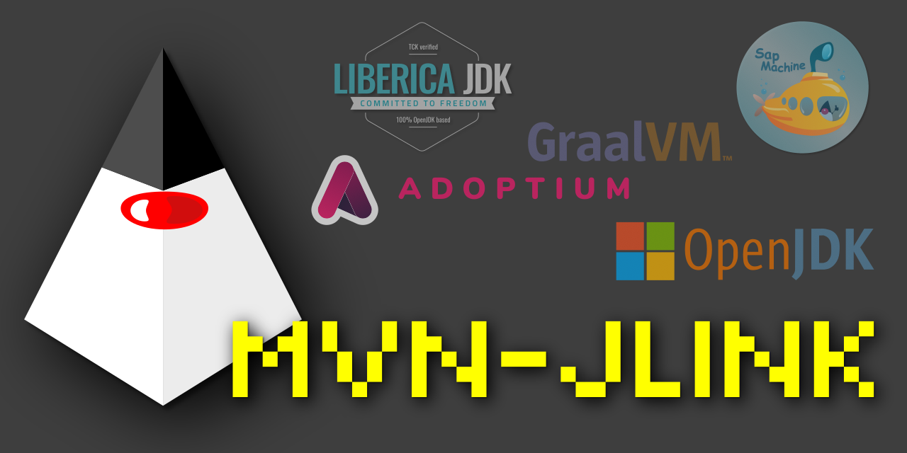

[](http://www.apache.org/licenses/LICENSE-2.0)
[](http://www.oracle.com/technetwork/java/javase/downloads/index.html)
[](http://search.maven.org/#artifactdetails|com.igormaznitsa|mvn-jlink-wrapper|1.2.0|jar)
[](https://maven.apache.org/)
[](https://www.paypal.com/cgi-bin/webscr?cmd=_s-xclick&hosted_button_id=AHWJHJFBAWGL2)
[](https://yoomoney.ru/to/41001158080699)



# Changelog

__1.2.1 (24-mar-2023)__

- fixed incompatibility with maven 3.9
- provided way to force tool file extensions per Os
  through `forceOsExtensions` [#10](https://github.com/raydac/mvn-jlink/issues/10)
- provided way to force host OS type through `forceHostOs`

__1.2.0 (18-sep-2022)__

- added digest download and check for Git based providers
- __removed ADOPT and ADOPTGIT providers, now they covered by new ADOPTIUM provider__
- __added MICROSOFT OpenJDK provider__
- __added URL provider to use direct URL__
- refactoring

[full changelog](CHANGELOG.txt)

# Introduction

Since Java 9, JDK has modules (project Jigsaw) and it provides more or less smoothly way to build JDK versions
containing only needed modules. Such formed JDK image can be delivered together with Java application. Because I have
several Java based OSS projects (like [SciaReto](http://www.igormaznitsa.com/netbeans-mmd-plugin/)
and [ZXPoly emulator](https://github.com/raydac/zxpoly)) which would be nicer with provided pre-built JDK image, I
decided to automate processing of JDK image build and have developed the maven plug-in (because Maven is the main tool
which I use for OSS projects).

# What does it do?

Functionality of the plugin is very easy, it just provides way to execute tools placed in JDK/bin folder like jdeps and
jlink, but sometime it is needed to make image of a specific JDK, for such cases my plugin has internal mechanism which
automatically downloads needed variant of OpenJDK from a provider, unpack it and the JDK can be used to build JDK image.

At present the plug-in supports listed OpenJDK providers:

* __LOCAL__ - locally provided JDK will be used for operations
* __URL__ - load archive through directly provided URL with optional check of file digest (sha1, sha256, sha384, sha512,
  md2, md3)
* __[MICROSOFT](https://www.microsoft.com/openjdk)__ - Prebuilt binary archives of Microsoft OpenJDK
* __[BELLSOFT](https://www.bell-sw.com/java.html)__ - _(Git based)_ Prebuilt binary archives of OpenJDK 'LIBERICA' for
  many platforms including embedded ones, __it has versions includes JavaFX module__.
* __[ADOPTIUM](https://adoptium.net/)__ - _(Git based)_ Prebuilt binary archives of OpenJDK Eclipse Adoptium for many
  platforms.
* __[SAPMACHINE](https://github.com/SAP/SapMachine)__ - _(Git based)_ Prebuilt binary archives of OpenJDK provided by
  SAP.
* __[GRAALVMCE](https://github.com/graalvm/graalvm-ce-builds)__ - _(Git based)_ Prebuilt JDK distributives of GraalVM
  Community Edition.

> **Warning**  
> For Git based providers, it is possible to tune page size during search through `perPage` parameter (by default 40).
> Also it is possible to disable check of digests through configuration boolean `check` parameter (which by default true).

# Goals and parameters

The plug-in provides four goals:

## Goal `cache-jdk`

The goal just downloads JDK from a provider, unpack it and placing the JDK folder path into Maven custom named project
property which can be used by other plug-ins.

### Examples

Code snippet shows caching of JDK downloaded directly through URL, it will be automatically downloaded and unpacked into
plug-in's cache and its path will be provided in maven project through `jlink.jdk.path` property

```xml

<plugin>
    <groupId>com.igormaznitsa</groupId>
    <artifactId>mvn-jlink-wrapper</artifactId>
    <version>1.2.0</version>
    <executions>
        <execution>
            <id>cache-jdk18-openjdk-x64</id>
            <goals>
                <goal>cache-jdk</goal>
            </goals>
            <id>do-cache-jdk</id>
            <goals>
                <goal>cache-jdk</goal>
            </goals>
            <configuration>
                <jdkPathProperty>jlink.jdk.path</jdkPathProperty>
                <jdkCachePath>${project.build.directory}${file.separator}jdkCache</jdkCachePath>

                <provider>URL</provider>
                <providerConfig>
                    <id>openjdk-18-linux-x64</id>
                    <url>
                        https://download.java.net/java/GA/jdk18.0.2/f6ad4b4450fd4d298113270ec84f30ee/9/GPL/openjdk-18.0.2_linux-x64_bin.tar.gz
                    </url>
                    <sha256>cf06f41a3952038df0550e8cbc2baf0aa877c3ba00cca0dd26f73134f8baf0e6</sha256>
                </providerConfig>
            </configuration>
        </execution>
    </executions>
</plugin>
```

Code snippet shows caching of GraalVM CE, the GraalVM distributive will be automatically downloaded and unpacked into
plug-in's cache and its path will be provided in maven project through `jlink.jdk.path` property

```xml

<plugin>
    <groupId>com.igormaznitsa</groupId>
    <artifactId>mvn-jlink-wrapper</artifactId>
    <version>1.2.0</version>
    <executions>
        <execution>
            <id>cache-jdk17-graalvmce</id>
            <goals>
                <goal>cache-jdk</goal>
            </goals>
            <id>do-cache-jdk</id>
            <goals>
                <goal>cache-jdk</goal>
            </goals>
            <configuration>
                <jdkPathProperty>jlink.jdk.path</jdkPathProperty>
                <jdkCachePath>${project.build.directory}${file.separator}jdkCache</jdkCachePath>

                <provider>GRAALVMCE</provider>
                <providerConfig>
                    <type>java17</type>
                    <version>22.2.0</version>
                    <arch>amd64</arch>
                </providerConfig>
            </configuration>
        </execution>
    </executions>
</plugin>
```

Code snippet shows configuration to cache OpenJDK from ADOPTION provider in project build folder and then save path to
its folder into `jlink.jdk.path` project property
```xml
<plugin>
    <groupId>com.igormaznitsa</groupId>
    <artifactId>mvn-jlink-wrapper</artifactId>
    <version>1.2.0</version>
    <executions>
        <execution>
            <id>cache-jdk-8</id>
            <goals>
                <goal>cache-jdk</goal>
            </goals>
            <configuration>
                <jdkPathProperty>jlink.jdk.path</jdkPathProperty>
                <jdkCachePath>${project.build.directory}${file.separator}jdkCache</jdkCachePath>

                <provider>ADOPTIUM</provider>
                <providerConfig>
                    <version>8U</version>
                    <arch>x64</arch>
                    <type>jdk</type>
                    <impl>hotspot</impl>
                    <build>8u332b09</build>
                </providerConfig>
            </configuration>
        </execution>
    </executions>
</plugin>
```

## Goal `jdeps`
The goal automates work with `JDK/bin/jdeps` utility, it allows to get list of modules needed by a JAR and save result into a file.
### Example
The example calls jdeps tool from provided JDK over project jar file and saves output into `jdeps.out` situated in project build folder.
```xml
<plugin>
    <groupId>com.igormaznitsa</groupId>
    <artifactId>mvn-jlink-wrapper</artifactId>
    <version>1.2.0</version>
    <executions>
        <execution>
            <id>call-jdeps</id>
            <goals>
                <goal>jdeps</goal>
            </goals>
            <configuration>
                <output>${project.build.directory}${file.separator}jdeps.out</output>
                <options>
                    <option>${project.build.directory}${file.separator}${project.build.finalName}.jar</option>
                </options>
            </configuration>
        </execution>
    </executions>
</plugin>
```

## Goal `jlink`
The goal automates work with `JDK/bin/jlink` utility, it allows to build JDK image based on `jdeps` output.
### Example
The example calls `jlink` from provided JDK and build JDK version based on report provided by `jdeps` tool in `jdeps.out` file, also `java.compiler` module will be added. The prepared JDK version will be presented in project build folder, subfolder `preparedJDK`
```xml
<plugin>
    <groupId>com.igormaznitsa</groupId>
    <artifactId>mvn-jlink-wrapper</artifactId>
    <version>1.2.0</version>
    <executions>
        <execution>
            <id>call-jlink</id>
            <goals>
                <goal>jlink</goal>
            </goals>
            <configuration>
                <jdepsReportPath>${project.build.directory}${file.separator}jdeps.out</jdepsReportPath>
                <output>${project.build.directory}${file.separator}preparedJDK</output>
                <modulePaths>
                    <path>${java.home}${file.separator}jmods</path>
                </modulePaths>
                <addModules>
                    <module>java.compiler</module>
                </addModules>
                <options>
                    <option>--compress=2</option>
                    <option>--no-header-files</option>
                    <option>--no-man-pages</option>
                </options>
            </configuration>
        </execution>
    </executions>
</plugin>
```

## Goal `jdk-tool`
It is a universal goal, it allows to make call to any tool situated in `JDK/bin` and save its output into files.
### Example
The example calls jps tool from provided tool JDK with 5 seconds timeout and its output will be written into `jps.out` file.
```xml
<plugin>
    <groupId>com.igormaznitsa</groupId>
    <artifactId>mvn-jlink-wrapper</artifactId>
    <version>1.2.0</version>
    <executions>
        <execution>
            <id>call-tool</id>
            <phase>package</phase>
            <goals>
                <goal>jdk-tool</goal>
            </goals>
            <configuration>
                <output>${project.build.directory}${file.separator}jps.out</output>
                <tool>jps</tool>
                <timeout>5</timeout>
                <options>
                    <option>-m</option>
                </options>
            </configuration>
        </execution>
    </executions>
</plugin>
```

# Mind Map of the plug-in
Created with [SciaReto](http://sciareto.org)   

